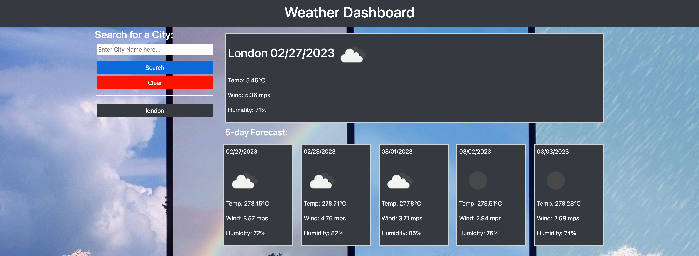

# Weather-Dashboard

This project was to get us to use what have learnt in the previous lessons and apply it to a more practical scenario.

This application allowed us to practice using APIs and Local Storage. With API's we had to get the Data and display that data on the page dynamically with user input. Local storage was used to store data input and also clear it when needed.

This project required us to hit the following requirements;

* Create a weather dashboard with form inputs.
  * When a user searches for a city they are presented with current and future conditions for that city and that city is added to the search history
  * When a user views the current weather conditions for that city they are presented with:
    * The city name
    * The date
    * An icon representation of weather conditions
    * The temperature
    * The humidity
    * The wind speed
  * When a user view future weather conditions for that city they are presented with a 5-day forecast that displays:
    * The date
    * An icon representation of weather conditions
    * The temperature
    * The humidity
  * When a user click on a city in the search history they are again presented with current and future conditions for that city

## Image of Weather Dashboard

## Link to deployed website

